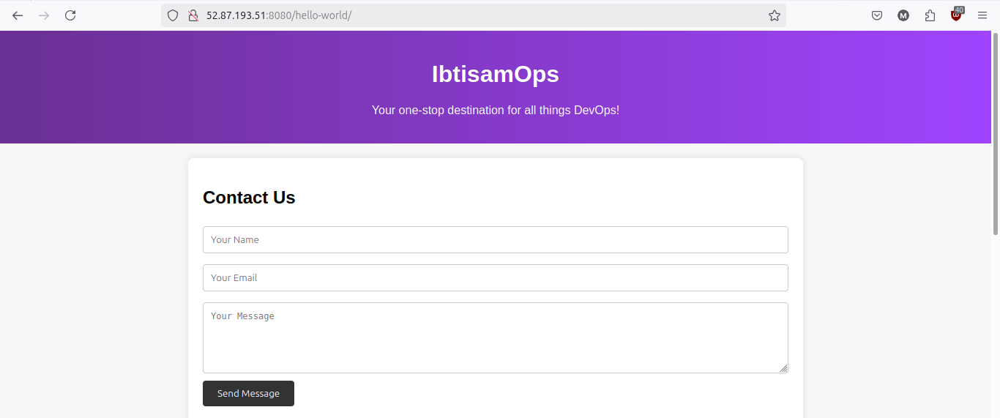

# Apache Tomcat 9.0.65 Installation and Configuration Guide

This guide provides step-by-step instructions for installing Apache Tomcat 9.0.65 on a Linux system, configuring the server, and setting up administrative access.

## Table of Contents

1. [Prerequisites](#prerequisites)
2. [Installation Steps](#installation-steps)
   - [1. Download and Extract Tomcat](#1-download-and-extract-tomcat)
   - [2. Configure Tomcat Users](#2-configure-tomcat-users)
   - [3. Create Start and Stop Scripts](#3-create-start-and-stop-scripts)
   - [4. Modify Access Restrictions](#4-modify-access-restrictions)
3. [Starting and Stopping Tomcat](#starting-and-stopping-tomcat)
4. [License](#license)

## Prerequisites

- A Linux-based operating system with `sudo` privileges.
- Basic knowledge of Linux command-line operations.

## Installation Steps

### 1. Download and Extract Tomcat

1. **Switch to the root user:**

   ```bash
   sudo su
   ```

2. **Navigate to the `/opt` directory:**

   ```bash
   cd /opt
   ```

3. **Download the Apache Tomcat 9.0.65 tarball:**

   ```bash
   sudo wget https://archive.apache.org/dist/tomcat/tomcat-9/v9.0.65/bin/apache-tomcat-9.0.65.tar.gz
   ```

4. **Extract the downloaded tarball:**

   ```bash
   sudo tar -xvf apache-tomcat-9.0.65.tar.gz
   ```

### 2. Configure Tomcat Users

1. **Navigate to the Tomcat configuration directory:**

   ```bash
   cd /opt/apache-tomcat-9.0.65/conf
   ```

2. **Edit the `tomcat-users.xml` file to add an admin user:**

   ```bash
   sudo vi tomcat-users.xml
   ```

3. **Add the following line before the closing `</tomcat-users>` tag:**

   ```xml
   <user username="ibtisam" password="ibtisam.1" roles="admin-gui,manager-gui,manager-script"/>
   ```

   This creates an admin user with the username `ibtisam` and the password `ibtisam.1`. The user is assigned roles that allow access to the administrative and management interfaces.

### 3. Create Start and Stop Scripts

1. **Create symbolic links for the Tomcat start and stop scripts:**

   ```bash
   sudo ln -s /opt/apache-tomcat-9.0.65/bin/startup.sh /usr/bin/startTomcat
   sudo ln -s /opt/apache-tomcat-9.0.65/bin/shutdown.sh /usr/bin/stopTomcat
   ```

   These links allow you to start and stop Tomcat using the `startTomcat` and `stopTomcat` commands from any directory.

### 4. Modify Access Restrictions

1. **Edit the `context.xml` file for the Manager web application:**

   ```bash
   sudo vi /opt/apache-tomcat-9.0.65/webapps/manager/META-INF/context.xml
   ```

2. **Comment out the `RemoteAddrValve` configuration:**

   ```xml
   <!--
   <Valve className="org.apache.catalina.valves.RemoteAddrValve"
   allow="127\.\d+\.\d+\.\d+|::1|0:0:0:0:0:0:0:1" />
   -->
   ```

   This change removes the restriction that only allows access to the Manager application from localhost.

3. **Edit the `context.xml` file for the Host Manager web application:**

   ```bash
   sudo vi /opt/apache-tomcat-9.0.65/webapps/host-manager/META-INF/context.xml
   ```

4. **Comment out the `RemoteAddrValve` configuration:**

   ```xml
   <!--
   <Valve className="org.apache.catalina.valves.RemoteAddrValve"
   allow="127\.\d+\.\d+\.\d+|::1|0:0:0:0:0:0:0:1" />
   -->
   ```

   This change removes the restriction that only allows access to the Host Manager application from localhost.

## Starting and Stopping Tomcat

- **To stop Tomcat:**

  ```bash
  sudo stopTomcat
  ```

- **To start Tomcat:**

  ```bash
  sudo startTomcat
  ```

These commands will control the Tomcat server's operation.

## License

This project is licensed under the Apache License, Version 2.0. See the [LICENSE](https://www.apache.org/licenses/LICENSE-2.0) file for more details.

## Project Structure

Please refer to `consoleOutput.txt` for more details. 😊

## Project Snapshot



